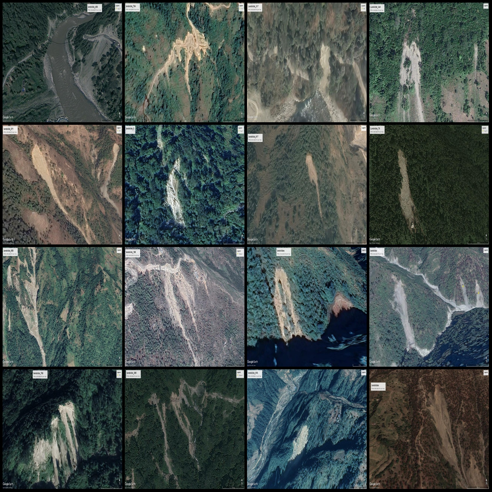
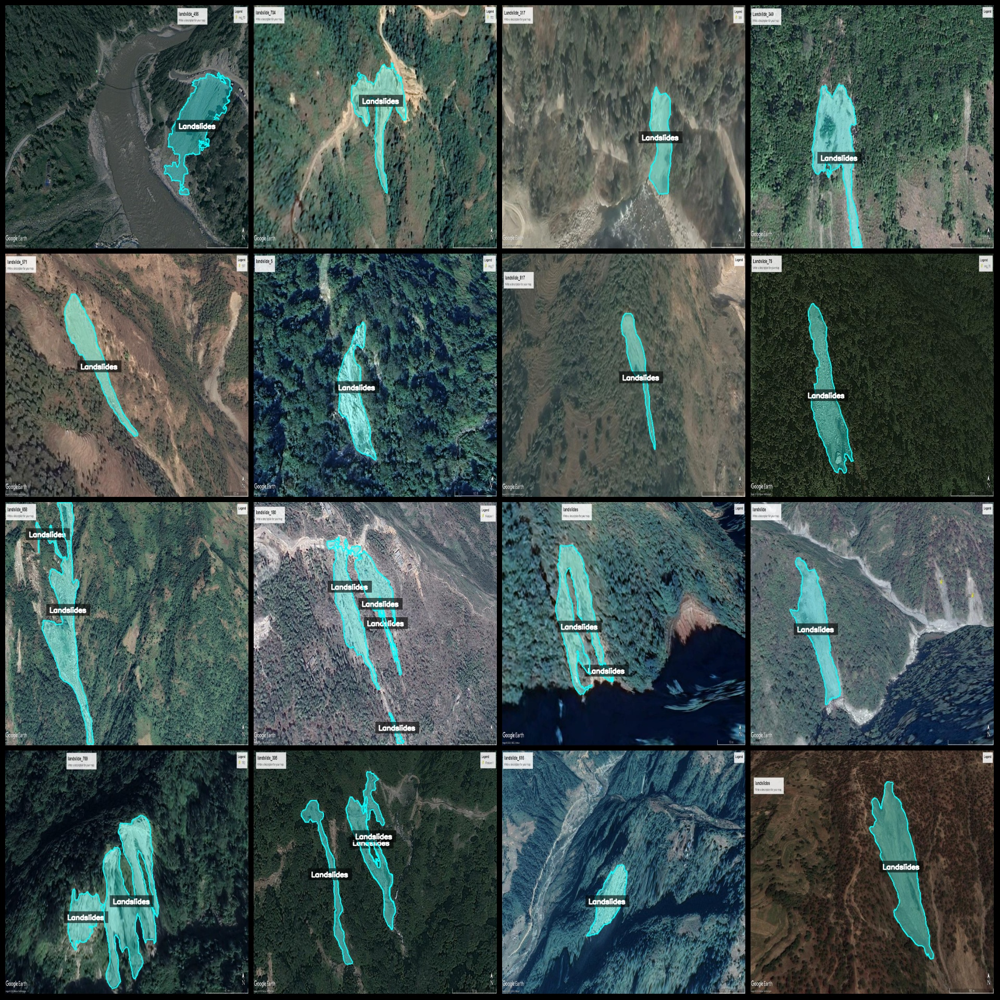
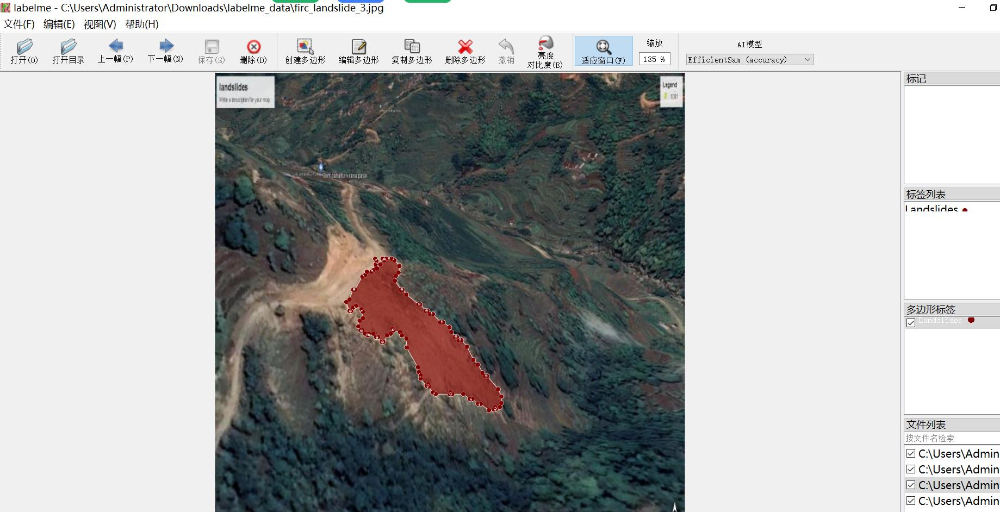

# Remote Sensing Image Landslide Identification and Segmentation Dataset in LabelMe Format - 991 Images with One Category

Dataset format: LabelMe (excluding mask files, only containing JPG images and corresponding JSON files)
Number of images (JPG file count): 991
Number of labels (JSON file count): 991
Number of label categories: 1
Label category name: "Landslides"
Number of bounding boxes per category: 1322
Used labeling tool: labelme=5.5.0
Image resolution: 640x640
Labeling rules: Polygons are drawn around the categories
Important note: The dataset can be edited using LabelMe; for JSON datasets, you need to convert them into Mask or YOLOF format or COCO format for semantic segmentation or instance segmentation.
Special declaration: This dataset does not guarantee the accuracy of the trained models or weight files.
Image previews:
Example of labeled images (selecting 16 random images):
Labeled drawing results:
LabelMe editing image examples:

## Images

Here is a pay link on Stripe ( https://buy.stripe.com/3cs8yP7sY87d0vu9AB ). Please contact me lonlonago@foxmail.com after funding $89, and I will send you a complete data files , thank you!

